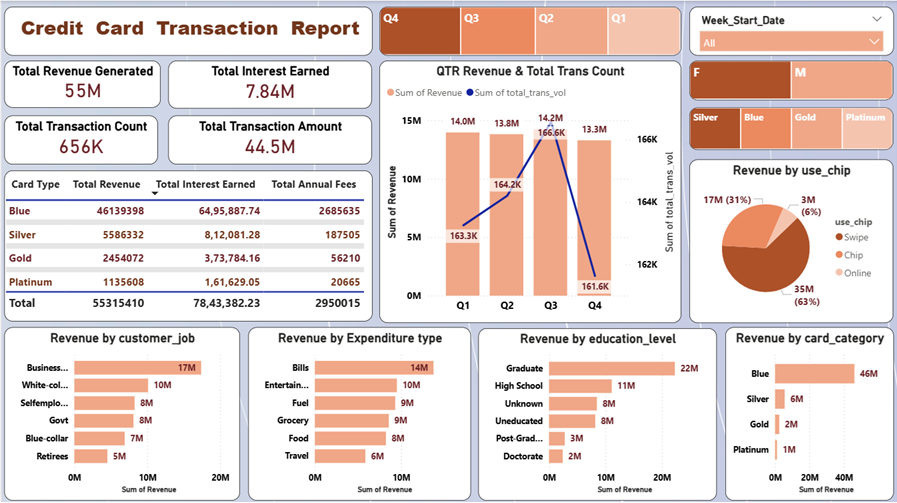
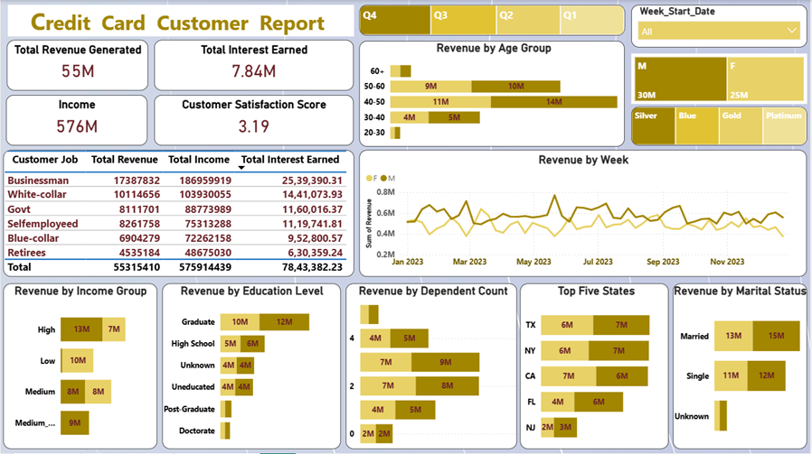

## Credit-Card-Transaction-Analysis-Dashboard

## Project Overview
This project analyzes credit card transaction data to understand customer spending behavior, revenue trends, and transaction patterns. The goal is to generate actionable business insights that help financial institutions better understand their customers and optimize credit card offerings.

The dashboards were built in Power BI using data extracted from a PostgreSQL database. The project uses DAX measures and calucated columns to analyze revenue, transaction pattern, and customer demographics.

## Tools & Technologies
- SQL (PostgreSQL)
- Power BI
- DAX
- Data Visualization

## Dataset Description
The dataset contains credit card transaction information including:
- Customer demographics (age, gender, education, marital status)
- Card Category (Blue, Silver, Gold, Platinum)
- Transaction amount and transaction count
- Payment Methods (Swipe, Chip, Online)

## Key Business Questions
- Which card category generates the highest revenue?
- Which customer demographics contribute the most revenue?
- What are the top spending categories for credit card transactions?
- Which payment method is most commonly used by customers?
- Which states generate the highest credit card revenue?
- How do transaction volumes change across different quarters?

## Dashboard Features

# Credit Card Customer Dashboard
This dashboard analyzes customer demographics and revenue contribution.

Key Metrics Analyzed:
- Revenue by gender
- Revenue by age group
- Revenue by education level
- Revenue by marital status
- Revenue by dependent count
- Revenue by state

# Credit Card Transaction Dashboard
This dashboard focuses on credit card transaction behavior.

Key Metrics Analyzed:
- Total revenue generated
- Tptal transaction volume
- Interest revenue
- Revenue by card category
- Revenue by spending category
- Revenue by payment method
- Quaterly revenue trends

## Key Insights
- The analysis shows total revenue of 57M generated from 667k transactions.
- *Blue card category* generates the highest revenue (~47M), indicating that the majority of revenue comes from mass-market cardholders.
- Customers aged between 40-50 contribute the highest share of revenue, highlighting this group as a valuable customer segment.
- Bills and entertainment are the top spending categories, showing that credit cards are commonly used for recurring expenses and lifestyle spending.
- Swipe transactions dominate payment methods, accounting for the majority of credit card usage compared to chip or online transactions.
- Male customers contribute 31M in revenue whilw female customers contribute 26M, indicating a relatively balanced spending pattern with slightly higher contribution from male cardholders.
- Texas, New york, and California generate the highest credit card revenue, suggesting strong credit card usage in major economic regions.

## Business Recommendations
Based on the analysis, the following business recommendations can be considered:
- Target middle-aged customers (40-50) with personalized promotions and premium card upgrade offers.
- Encourage digital payment methods (Chip and online) through cashback incentives and reward programs.
- Promote higher-tier cards (Gold and Platinum) to high-spending Blue card customers.
- Provide category-based rewards for frequently used spending categories such as bills and entertainment.

## Dashboards Preview
[]
(transactions_dashboard_images.png)

[
(customer_dashboard_image.png)

